   ## Fashion Store 
   *An eccoemerce website of garments*


## Prerequisities
- Python 3.7
- Mongodb

## How to start?
```
1. Clone the repository
      git clone https://github.com/mohitarora3/Fashion-Store
      cd  ecommerce

2. Create and activate a virtual environment
      virtualenv env 
      source env/Scripts
      activate
   
3. Install requirements:-
      pip install -r requirements.txt
    
4. Run the application
      python run.py
      
5. Open http://127.0.0.1.5000./

```

## Technologies used:-
 - Python
 - Flask
 - Mongodb
 - Html
 - Css
 - Javascript


 ## Current Functionalities:-
- User, seller can register and sign in.
- Multiple Sellers can sell their products.
- Customer can browse products.
- Filter products based on brand, gender, price and discount.
- Customer can rate and review product.
- Customer can add/remove products from wishlist.
- Customer can move products from wishlist to cart.
- Customer can add/ remove items from cart.
- Customer can place order.
- Customer can get additional discounts on purchase.
- Customer can cancel an order.

## Under Development:
- Online payment gateway

## Screenshots
   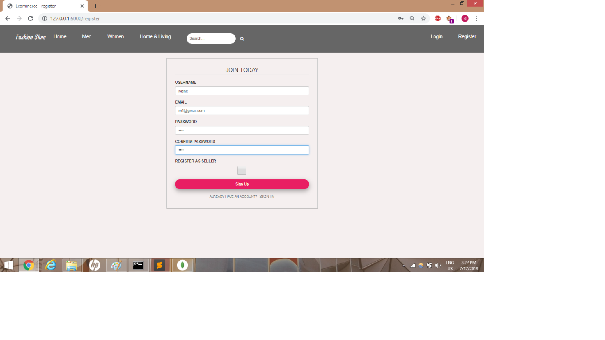 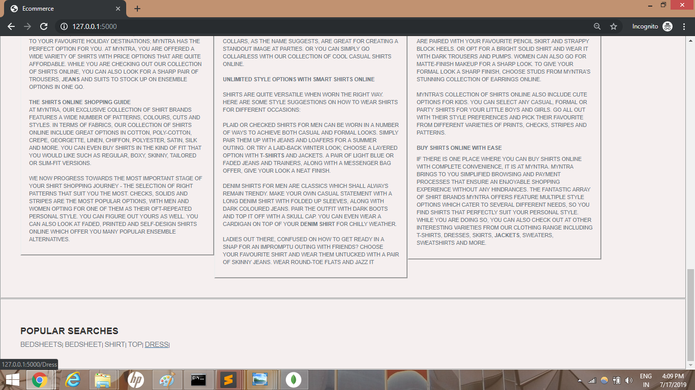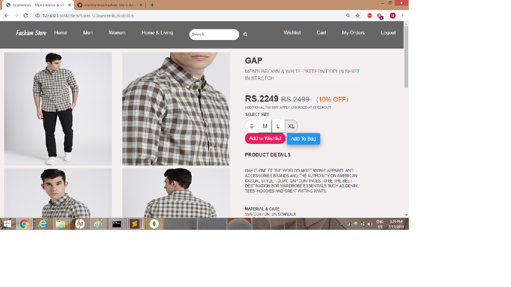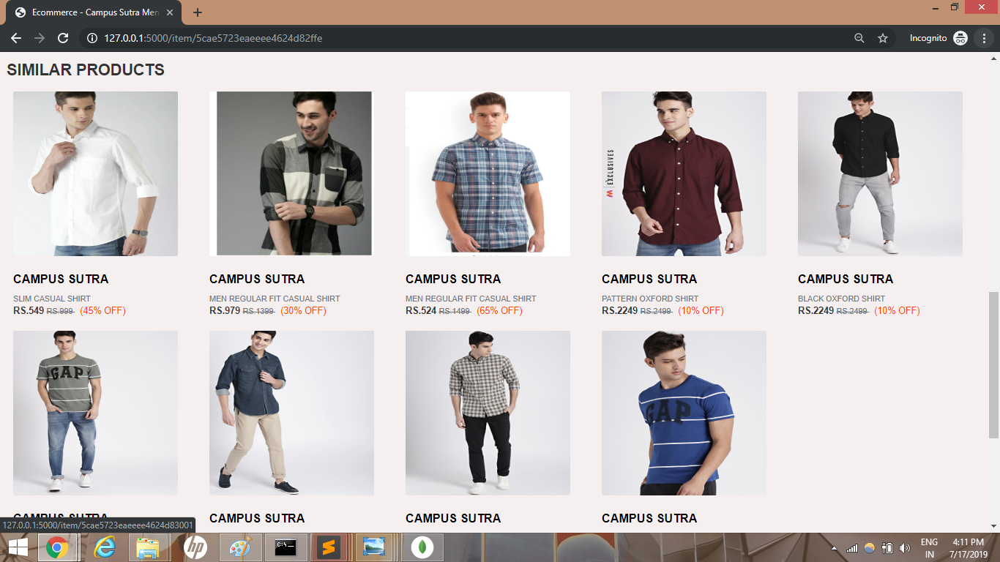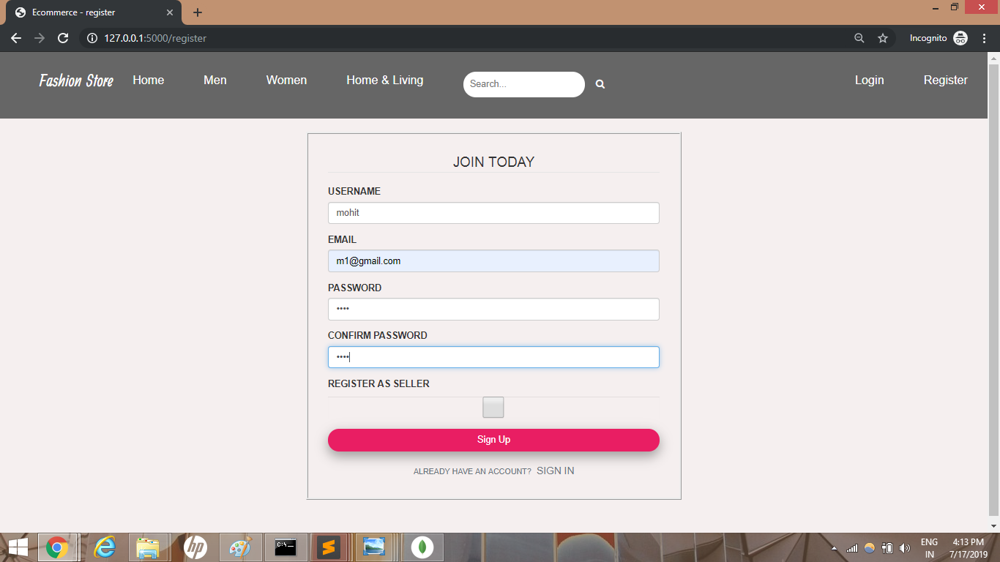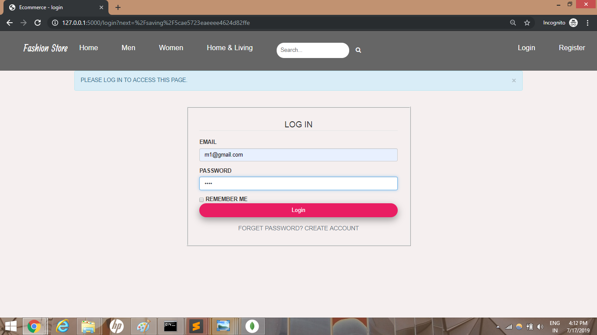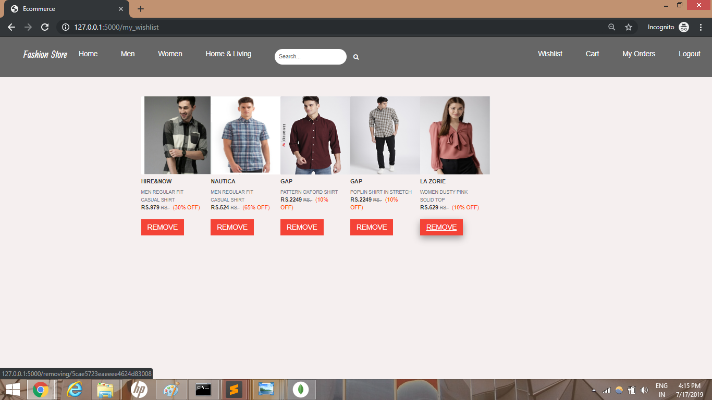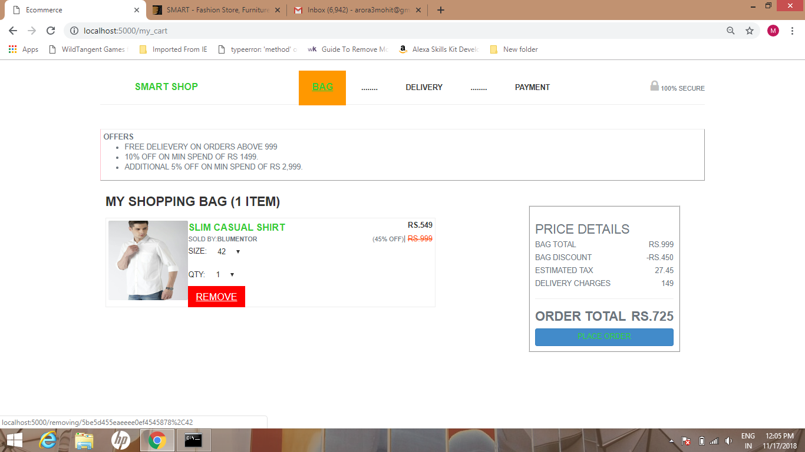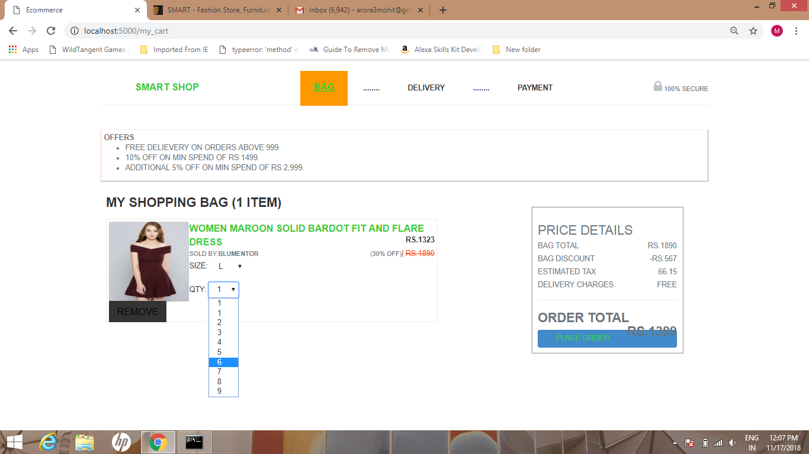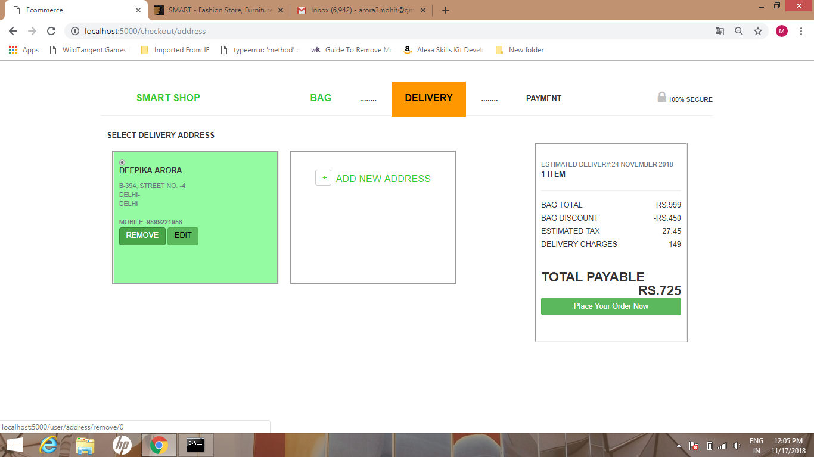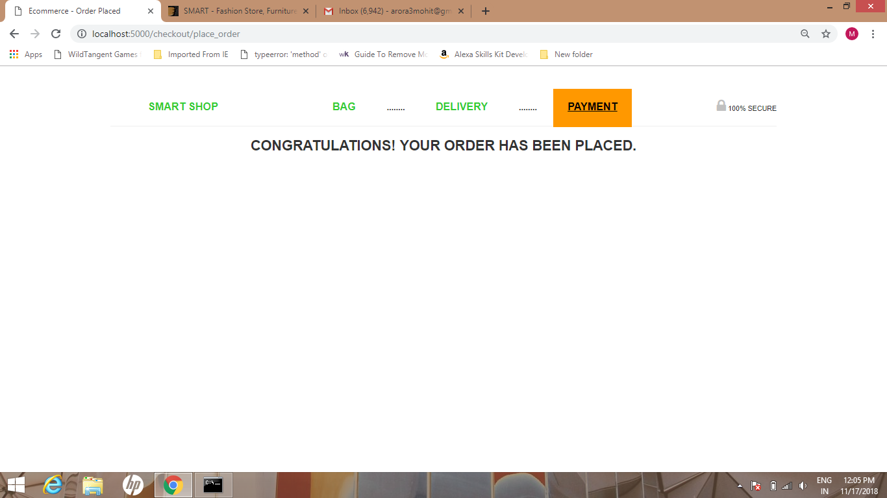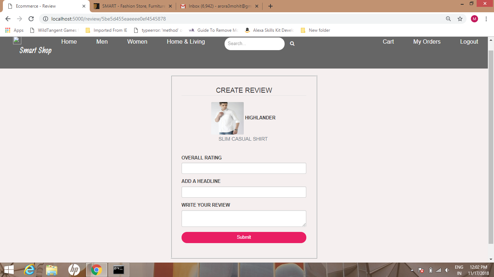 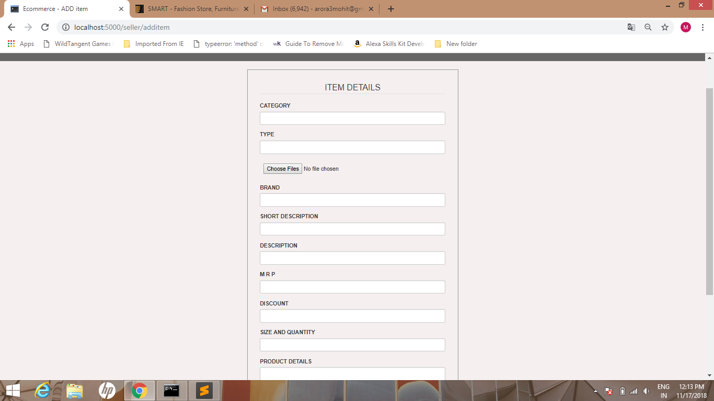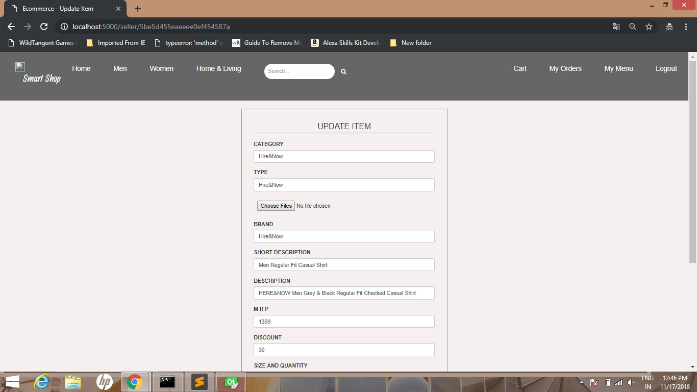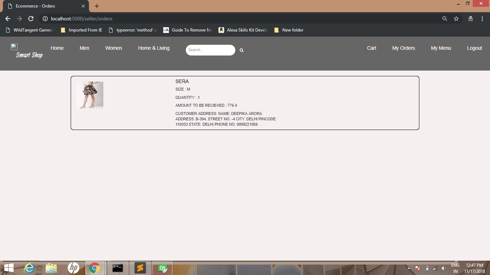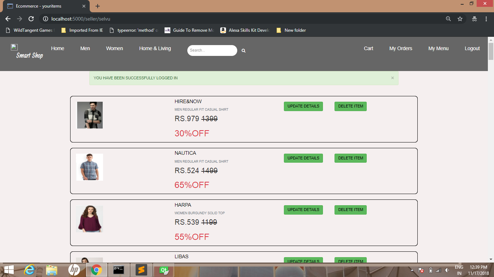
